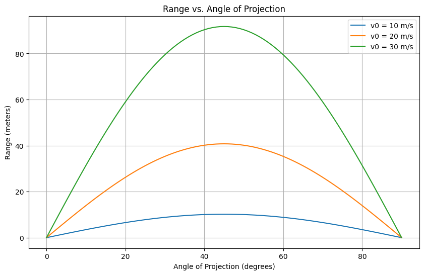

# Investigating the Range as a Function of the Angle of Projection

Projectile motion is a classic yet endlessly fascinating topic in physics. It’s the perfect blend of simplicity and depth—starting with basic principles, we can unlock a wealth of understanding about how objects move through the air. Our goal here is to analyze how the horizontal range of a projectile depends on its launch angle, explore the influence of various parameters, and bring it to life with a computational simulation.

## 1. Theoretical Foundation

### Deriving the Equations of Motion

Let’s start from the ground up with Newton’s second law. For a projectile launched with an initial velocity $v_0$ at an angle $\theta$ from the horizontal, we assume no air resistance (we’ll revisit this assumption later). The only force acting is gravity, with acceleration $g$ downward.

- **Coordinate System**: Define $x$ as the horizontal direction and $y$ as vertical, with the origin at the launch point ($y_0 = 0$ for now).
- **Forces**: No horizontal force ($F_x = 0$), vertical force is gravity ($F_y = -mg$).

The accelerations are:
- $a_x = \frac{d^2x}{dt^2} = 0$
- $a_y = \frac{d^2y}{dt^2} = -g$

Integrate these differential equations:
- Horizontal: $\frac{dx}{dt} = v_x = v_0 \cos\theta$ (constant, since $a_x = 0$)
  - $x(t) = (v_0 \cos\theta) t$
- Vertical: $\frac{dy}{dt} = v_y = v_0 \sin\theta - gt$
  - $y(t) = (v_0 \sin\theta) t - \frac{1}{2} g t^2$

These are the parametric equations of motion. The projectile follows a parabolic trajectory, and the family of solutions depends on $v_0$, $\theta$, and $g$. If we include an initial height $y_0$, the vertical equation becomes:
- $y(t) = y_0 + (v_0 \sin\theta) t - \frac{1}{2} g t^2$

### Time of Flight

The projectile hits the ground when $y(t) = 0$. For $y_0 = 0$:
- $0 = (v_0 \sin\theta) t - \frac{1}{2} g t^2$
- Factor out $t$: $t [v_0 \sin\theta - \frac{1}{2} g t] = 0$
- Solutions: $t = 0$ (launch) or $t = \frac{2 v_0 \sin\theta}{g}$ (time of flight, $T$).

## 2. Analysis of the Range

### Range Equation

The horizontal range $R$ is the distance traveled when $y = 0$:
- $R = x(T) = (v_0 \cos\theta) \cdot \frac{2 v_0 \sin\theta}{g}$
- Using the identity $\sin(2\theta) = 2 \sin\theta \cos\theta$:
  - $R = \frac{v_0^2 \sin(2\theta)}{g}$

This is the key relationship! The range depends on:
- $\theta$: Through $\sin(2\theta)$, which peaks at $2\theta = 90^\circ$, so $\theta = 45^\circ$ maximizes $R$.
- $v_0$: Quadratically, so doubling the speed quadruples the range.
- $g$: Inversely, so stronger gravity reduces range.

### Parameter Influence

- **Angle ($\theta$)**: $R = 0$ at $\theta = 0^\circ$ or $90^\circ$ (straight along or up), with a maximum at $45^\circ$.
- **Initial Velocity ($v_0$)**: Higher $v_0$ stretches the parabola, increasing $R$.
- **Gravity ($g$)**: On the Moon ($g \approx 1.62 \, \text{m/s}^2$), range is much larger than on Earth ($g \approx 9.81 \, \text{m/s}^2$).

## 3. Practical Applications

This model applies to:
- **Sports**: A soccer ball kicked at an angle—45° gives the farthest distance on flat ground.
- **Engineering**: Cannonball trajectories or water jets from a hose.
- **Astrophysics**: Simplified rocket launches (ignoring air resistance initially).

For uneven terrain (e.g., $y = 0$ at a different height), adjust the time-of-flight equation. With air resistance, the equations become nonlinear, requiring numerical solutions—think of a golf ball’s dimples reducing drag.

## 4. Implementation

Let’s simulate this in Python using NumPy and Matplotlib.


```python
import numpy as np
import matplotlib.pyplot as plt

# Parameters
g = 9.81  # m/s^2
v0_values = [10, 20, 30]  # initial velocities (m/s)
theta_deg = np.linspace(0, 90, 91)  # angles from 0 to 90 degrees
theta_rad = np.radians(theta_deg)

# Range function
def range_proj(v0, theta, g):
    return (v0**2 * np.sin(2 * theta)) / g

# Compute ranges for different v0
ranges = {v0: range_proj(v0, theta_rad, g) for v0 in v0_values}

# Plotting
plt.figure(figsize=(10, 6))
for v0, R in ranges.items():
    plt.plot(theta_deg, R, label=f'v0 = {v0} m/s')
plt.xlabel('Angle of Projection (degrees)')
plt.ylabel('Range (meters)')
plt.title('Range vs. Angle of Projection')
plt.legend()
plt.grid(True)
plt.show()


# Highlight maximum range at 45 degrees
for v0 in v0_values:
    R_max = range_proj(v0, np.radians(45), g)
    print(f"Max range for v0 = {v0} m/s at 45°: {R_max:.2f} m")