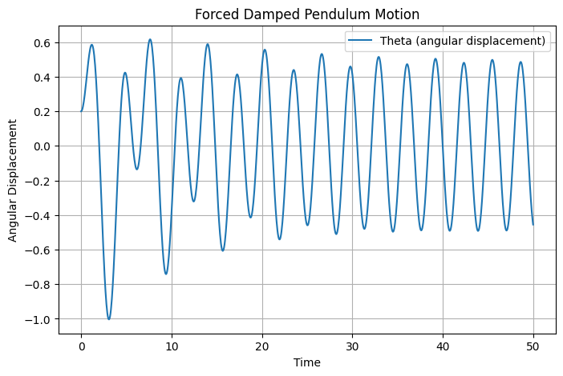

# Investigating the Dynamics of a Forced Damped Pendulum

## Motivation

The forced damped pendulum is a captivating example of a physical system with intricate behavior resulting from the interplay of damping, restoring forces, and external driving forces. By introducing both damping and external periodic forcing, the system demonstrates a transition from simple harmonic motion to a rich spectrum of dynamics, including resonance, chaos, and quasiperiodic behavior. These phenomena serve as a foundation for understanding complex real-world systems, such as driven oscillators, climate systems, and mechanical structures under periodic stress.

Adding forcing introduces new parameters, such as the amplitude and frequency of the external force, which significantly affect the pendulum's behavior. By systematically varying these parameters, a diverse class of solutions can be observed, including synchronized oscillations, chaotic motion, and resonance phenomena. These behaviors not only highlight fundamental physics principles but also provide insights into engineering applications such as energy harvesting, vibration isolation, and mechanical resonance.

## 1. Theoretical Foundation

### Governing Equation

The motion of a forced damped pendulum is governed by the nonlinear differential equation:

$$
\frac{d^2\theta}{dt^2} + b \frac{d\theta}{dt} + \omega_0^2 \sin(\theta) = A \cos(\omega t)
$$

where:
- \(\theta\) is the angular displacement,
- \(b\) is the damping coefficient,
- \(\omega_0 = \sqrt{\frac{g}{L}}\) is the natural frequency of the pendulum,
- \(A\) is the amplitude of the external driving force,
- \(\omega\) is the driving frequency.

For small angles, we approximate \(\sin\theta \approx \theta\), leading to the linearized equation:

$$
\frac{d^2\theta}{dt^2} + b \frac{d\theta}{dt} + \omega_0^2 \theta = A \cos(\omega t)
$$

### Resonance Condition

Resonance occurs when the driving frequency \(\omega\) is close to the system's natural frequency \(\omega_0\). This leads to an increase in amplitude, potentially causing instability or breakdown of the approximation.

## 2. Analysis of Dynamics

- The damping coefficient \(b\) controls energy dissipation.
- The driving amplitude \(A\) determines how strongly the external force influences the motion.
- The driving frequency \(\omega\) dictates whether resonance or chaotic motion occurs.

The transition to chaotic motion can be studied by analyzing phase space diagrams and Poincaré sections.

## 3. Practical Applications

- **Energy Harvesting**: Used in piezoelectric devices that convert mechanical vibrations into electrical energy.
- **Structural Engineering**: Suspension bridges and tall buildings experience forced oscillations due to wind and earthquakes.
- **Electronics**: Analogous to driven RLC circuits in electrical engineering.


## 4. Implementation

To analyze the forced damped pendulum, we use Python to numerically solve the governing differential equation.

```python
import numpy as np
import matplotlib.pyplot as plt
from scipy.integrate import solve_ivp

# Define the equation of motion for the forced damped pendulum
def forced_damped_pendulum(t, y, b, omega0, A, omega):
    theta, omega_dot = y
    dtheta_dt = omega_dot
    domega_dt = -b * omega_dot - omega0**2 * np.sin(theta) + A * np.cos(omega * t)
    return [dtheta_dt, domega_dt]

# Parameters
b = 0.2        # Damping coefficient
omega0 = 1.5   # Natural frequency
A = 1.2        # Driving force amplitude
omega = 2.0    # Driving force frequency

# Initial conditions
theta0 = 0.1   # Initial angle
omega_dot0 = 0 # Initial angular velocity
y0 = [theta0, omega_dot0]

# Time range for the simulation
t_span = (0, 50)  # Simulation time
t_eval = np.linspace(*t_span, 1000)  # Time steps

# Solve the differential equation
solution = solve_ivp(forced_damped_pendulum, t_span, y0, t_eval=t_eval, args=(b, omega0, A, omega))

# Plot the results
plt.figure(figsize=(10, 5))
plt.plot(solution.t, solution.y[0], label=r'$\theta(t)$', color='b')
plt.xlabel('Time (s)')
plt.ylabel('Angular Displacement (rad)')
plt.title('Forced Damped Pendulum Motion')
plt.legend()
plt.grid()
plt.show()
```


## 5. Discussion on Model Limitations

- The model assumes a simple sinusoidal driving force; real-world forces may be more complex.
- Air resistance introduces additional nonlinear damping effects.
- Large-angle oscillations require the full nonlinear equation without the small-angle approximation.

## 6. Advanced Visualizations

To better analyze the system, we can visualize:

- **Phase Portraits:** Plotting \(\theta\) vs. \(d\theta/dt\) to observe periodic and chaotic behavior.
- **Poincaré Sections:** Sampling the phase space at regular time intervals.
- **Bifurcation Diagrams:** Varying \(A\) or \(\omega\) to observe transitions between periodic and chaotic motion.

## 7. Conclusion

The forced damped pendulum showcases rich dynamical behavior, from simple oscillations to chaotic motion. By adjusting parameters, we can explore resonance, synchronization, and chaotic regimes. This system has far-reaching applications in engineering, physics, and even biological systems such as gait dynamics and neural oscillations.

This study highlights the need for both analytical and numerical approaches to fully understand nonlinear systems. Future work can involve adding noise, considering variable damping, or exploring non-periodic driving forces.

