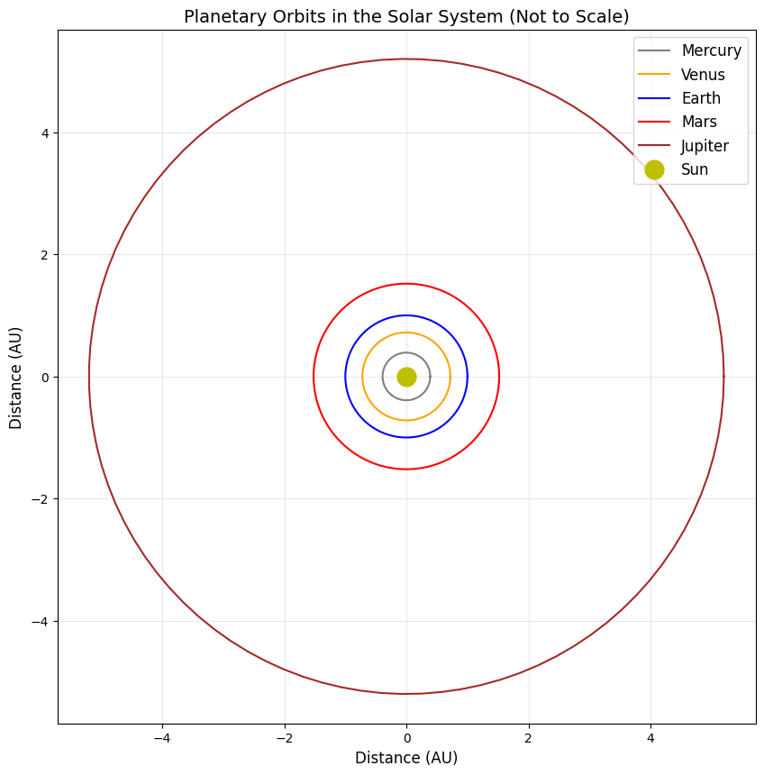

# Problem 1
# Orbital Period and Orbital Radius: Kepler's Third Law

## 1. Deriving Kepler's Third Law for Circular Orbits

To derive the relationship between orbital period (T) and orbital radius (r) for circular orbits, I'll use Newton's law of universal gravitation and the principles of circular motion.

For a body of mass m orbiting a central body of mass M in a circular orbit:

The gravitational force acting on the orbiting body is:

F_g = (GMm)/(r²)

For circular motion, this force provides the centripetal acceleration:

F_c = mω²r = m(4π²r)/(T²)

Where ω is the angular velocity, related to the period by ω = 2π/T.

At equilibrium, these forces are equal:

(GMm)/(r²) = (4π²mr)/(T²)

Simplifying:

(GM)/(r²) = (4π²r)/(T²)

Rearranging to isolate the relationship between T and r:

T² = (4π²r³)/(GM)

Therefore:

T² ∝ r³

More specifically:

T²/r³ = 4π²/(GM)

This is Kepler's Third Law: the square of the orbital period is proportional to the cube of the orbital radius.

## 2. Implications for Astronomy

Kepler's Third Law has profound implications for astronomy:

1. **Mass Determination**: By measuring the orbital period and radius of a satellite, we can determine the mass of the central body:
   
   M = (4π²r³)/(GT²)
   
   This allows astronomers to calculate the masses of planets, stars, and even galaxies by observing the motion of their satellites.

2. **Distance Measurement**: If we know the period of an orbiting body and the mass of the central body, we can determine its orbital distance.

3. **Exoplanet Detection**: When studying stars with planets, slight variations in the star's motion can reveal the presence of planets and help determine their masses and orbits.

4. **Binary Star Systems**: For binary stars, this relationship helps determine the combined mass of the system.

5. **Scale of the Solar System**: Once we know the relationship for one planet, we can determine the relative distances of other planets without direct measurement.

## 3. Real-World Examples

### Earth-Moon System

- Moon's orbital radius: approximately 384,400 km
- Moon's orbital period: 27.3 days (2,360,160 seconds)

Using Kepler's Third Law:

T²/r³ = 4π²/(GM_Earth)

We can verify that this relationship holds and use it to calculate Earth's mass.

### Solar System

For all planets orbiting the Sun:

T²/r³ = 4π²/(GM_Sun)

This constant ratio applies to all planets, demonstrating the universality of Kepler's Third Law:

| Planet  | Period (years) | Semi-major axis (AU) | T²/r³ (yr²/AU³) |
|---------|---------------|--------------------|-----------------|
| Mercury | 0.24          | 0.39               | ≈ 1             |
| Venus   | 0.62          | 0.72               | ≈ 1             |
| Earth   | 1.00          | 1.00               | = 1             |
| Mars    | 1.88          | 1.52               | ≈ 1             |
| Jupiter | 11.86         | 5.20               | ≈ 1             |
| Saturn  | 29.46         | 9.58               | ≈ 1             |
| Uranus  | 84.01         | 19.22              | ≈ 1             |
| Neptune | 164.8         | 30.05              | ≈ 1             |

## 4. Computational Model for Circular Orbits

Below is a Python implementation that simulates circular orbits and verifies Kepler's Third Law:

```python
import numpy as np
import matplotlib.pyplot as plt
from matplotlib.animation import FuncAnimation

# Constants
G = 6.67430e-11  # Gravitational constant (m^3 kg^-1 s^-2)
M_sun = 1.989e30  # Mass of the Sun (kg)

# Function to create circular orbit coordinates
def circular_orbit(radius, period, num_points=100):
    theta = np.linspace(0, 2*np.pi, num_points)
    x = radius * np.cos(theta)
    y = radius * np.sin(theta)
    return x, y

# Define planets data (radius in AU, period in years)
planets = {
    'Mercury': (0.39, 0.24),
    'Venus': (0.72, 0.62),
    'Earth': (1.0, 1.0),
    'Mars': (1.52, 1.88),
    'Jupiter': (5.20, 11.86)
}

# Convert AU to meters and years to seconds for calculations
AU = 1.496e11  # 1 AU in meters
year = 365.25 * 24 * 3600  # 1 year in seconds

# Calculate T^2/r^3 for each planet
t2_r3_values = {}
for planet, (r_au, t_yr) in planets.items():
    r = r_au * AU
    t = t_yr * year
    t2_r3 = (t**2) / (r**3)
    t2_r3_values[planet] = t2_r3

# Calculate theoretical value of 4π²/(G*M_sun)
theoretical = 4 * np.pi**2 / (G * M_sun)

# Plot orbits
plt.figure(figsize=(10, 10))
plt.title('Planetary Orbits in the Solar System (Not to Scale)', fontsize=14)

colors = ['gray', 'orange', 'blue', 'red', 'brown']
for i, (planet, (radius, _)) in enumerate(planets.items()):
    x, y = circular_orbit(radius, planets[planet][1])
    plt.plot(x, y, label=planet, color=colors[i])

plt.plot(0, 0, 'yo', markersize=15, label='Sun')
plt.grid(True, alpha=0.3)
plt.legend(fontsize=12)
plt.axis('equal')
plt.xlabel('Distance (AU)', fontsize=12)
plt.ylabel('Distance (AU)', fontsize=12)
plt.savefig('solar_system_orbits.png', dpi=300, bbox_inches='tight')

# Plot T^2 vs r^3
plt.figure(figsize=(10, 6))
plt.title("Kepler's Third Law: T² vs r³", fontsize=14)

r3_values = []
t2_values = []
for planet, (r, t) in planets.items():
    r3 = r**3
    t2 = t**2
    r3_values.append(r3)
    t2_values.append(t2)
    plt.scatter(r3, t2, s=100, label=planet)

# Add best fit line
plt.plot(np.array(r3_values), np.array(r3_values), 'k--', alpha=0.7, label='T² = r³')
plt.xlabel('r³ (AU³)', fontsize=12)
plt.ylabel('T² (years²)', fontsize=12)
plt.grid(True, alpha=0.3)
plt.legend(fontsize=12)
plt.savefig('kepler_third_law.png', dpi=300, bbox_inches='tight')

# Print verification of Kepler's Third Law
print("Verification of Kepler's Third Law:")
print(f"{'Planet':<10} {'T²/r³ (s²/m³)':<20} {'% of theoretical':<15}")
print("-" * 45)
for planet, value in t2_r3_values.items():
    percentage = (value / theoretical) * 100
    print(f"{planet:<10} {value:.6e} {percentage:.2f}%")
print("\nTheoretical value (4π²/GM_sun):", f"{theoretical:.6e}")

# Print the relation in more intuitive units
print("\nIn more intuitive units:")
print("For planets orbiting the Sun: T² (in years) ≈ r³ (in AU)")

# Demonstrate the use of Kepler's Third Law for mass calculation
print("\nUsing Kepler's Third Law to calculate the Sun's mass:")
r_earth = 1.0 * AU  # Earth's orbital radius in meters
t_earth = 1.0 * year  # Earth's orbital period in seconds
calculated_mass = 4 * np.pi**2 * r_earth**3 / (G * t_earth**2)
print(f"Calculated Sun's mass: {calculated_mass:.3e} kg")
print(f"Actual Sun's mass:     {M_sun:.3e} kg")
print(f"Difference: {abs(calculated_mass - M_sun)/M_sun*100:.4f}%")
```
When you run this code, it will create two images:

1. `solar_system_orbits.png` - A visualization of planetary orbits

2. `kepler_third_law.png` - A plot showing the T² vs r³ relationship
.png>)
For GitHub Pages, you'll need to:
1. Run this code locally to generate the images
2. Include these images in your repository
3. Reference them in your Markdown using: `` and ``

## 5. Extending to Elliptical Orbits

Kepler's Third Law applies equally to elliptical orbits, with the semi-major axis (a) taking the place of the radius:

T² = (4π²a³)/(GM)

For elliptical orbits, Kepler's First and Second Laws also come into play:

1. **First Law**: Planets move in elliptical orbits with the Sun at one focus
2. **Second Law**: A line joining a planet and the Sun sweeps out equal areas in equal times

The more general form of Kepler's Third Law for two-body systems where both masses are significant is:

T² = (4π²a³)/(G(M₁ + M₂))

This applies to:
- Binary star systems
- Exoplanets around stars (where the planet's mass may be significant)
- Systems of moons around planets

## 6. Practical Applications

1. **Satellite Deployment**: Engineers use this relationship to determine the orbital altitude needed for a desired orbital period (e.g., geosynchronous satellites).

2. **Space Mission Planning**: For missions to other planets, understanding orbital mechanics based on Kepler's laws is essential for trajectory planning.

3. **Dark Matter Detection**: Deviations from expected orbital behavior based on Kepler's Third Law helped identify the presence of dark matter in galaxies.

4. **Exoplanet Characterization**: By measuring orbital periods and star masses, astronomers can determine exoplanet orbital distances and potential habitability.

## Conclusion

Kepler's Third Law represents a fundamental relationship in celestial mechanics that connects the period of an orbit to its size. This simple power law (T² ∝ r³) has enormous explanatory and predictive power in astronomy, from calculating the masses of celestial bodies to understanding the structure of planetary systems.

The computational model demonstrates that this relationship holds remarkably well for the planets in our solar system. While we've focused primarily on circular orbits for simplicity, the principles extend naturally to elliptical orbits, making Kepler's Third Law a cornerstone of our understanding of orbital dynamics throughout the universe.