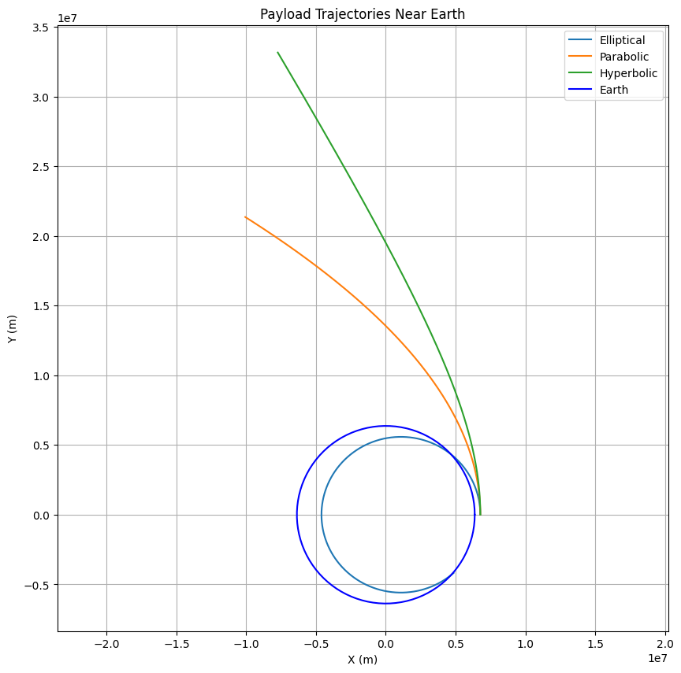

# problem 3
# Trajectories of a Freely Released Payload Near Earth

## Introduction

When a payload is released from a rocket near Earth, its trajectory depends on its initial position, velocity, and Earth’s gravitational influence. The possible paths—elliptical, parabolic, or hyperbolic—are determined by the payload’s specific mechanical energy. This problem combines orbital mechanics and numerical methods to explore these trajectories, which are critical for applications like satellite deployment, reentry, or interplanetary escape.

In this document, we will:
1. Explain the theoretical principles governing the payload’s motion.
2. Provide a Python script to simulate and visualize the trajectories.
3. Discuss the results and their implications for space missions.

## Theoretical Background

### Gravitational Force
The gravitational force acting on the payload is given by Newton’s Law of Gravitation:
\[
F = \frac{G M m}{r^2}
\]
where:
- \( G = 6.67430 \times 10^{-11} \, \text{m}^3 \text{kg}^{-1} \text{s}^{-2} \) (gravitational constant),
- \( M = 5.972 \times 10^{24} \, \text{kg} \) (Earth’s mass),
- \( m \) (payload mass),
- \( r \) (distance from Earth’s center).

The gravitational parameter \( \mu = G M \approx 3.986 \times 10^{14} \, \text{m}^3 \text{s}^{-2} \) is used for simplicity.

### Specific Mechanical Energy
The specific energy (\( \epsilon \)) dictates the trajectory:
\[
\epsilon = \frac{v^2}{2} - \frac{\mu}{r}
\]
- \( \epsilon < 0 \): Elliptical orbit (bound).
- \( \epsilon = 0 \): Parabolic trajectory (escape).
- \( \epsilon > 0 \): Hyperbolic trajectory (unbound).

### Trajectory Types
- **Elliptical**: A closed orbit (e.g., satellite in orbit).
- **Parabolic**: The boundary case for escape, achieved at escape velocity \( v_{\text{esc}} = \sqrt{\frac{2 \mu}{r}} \).
- **Hyperbolic**: Excess velocity leads to an open path away from Earth.

### Equations of Motion
In 2D Cartesian coordinates, the acceleration due to gravity is:
\[
\ddot{x} = -\frac{\mu x}{r^3}, \quad \ddot{y} = -\frac{\mu y}{r^3}
\]
where \( r = \sqrt{x^2 + y^2} \). These will be solved numerically.

---

## Python Simulation Code

Here’s the Python script to simulate and visualize the payload’s trajectories:

```python
import numpy as np
import matplotlib.pyplot as plt
from scipy.integrate import odeint

# Constants
mu = 3.986e14  # Earth's gravitational parameter (m^3/s^2)
R_earth = 6.371e6  # Earth's radius (m)

# Equations of motion
def equations_of_motion(state, t):
    x, y, vx, vy = state
    r = np.sqrt(x**2 + y**2)
    ax = -mu * x / r**3
    ay = -mu * y / r**3
    return [vx, vy, ax, ay]

# Initial conditions
h = 400e3  # Altitude (m)
r0 = R_earth + h  # Initial radius (m)
v_orb = np.sqrt(mu / r0)  # Circular orbit velocity (m/s)
v_esc = np.sqrt(2 * mu / r0)  # Escape velocity (m/s)

# Scenarios: [x0, y0, vx0, vy0]
initial_conditions = {
    "Elliptical": [r0, 0, 0, 0.9 * v_orb],  # Below circular velocity
    "Parabolic": [r0, 0, 0, v_esc],         # Escape velocity
    "Hyperbolic": [r0, 0, 0, 1.2 * v_esc]   # Above escape velocity
}

# Time array (1 hour simulation)
t = np.linspace(0, 3600, 1000)

# Simulate and plot
plt.figure(figsize=(10, 10))
for scenario, ic in initial_conditions.items():
    state0 = ic
    states = odeint(equations_of_motion, state0, t)
    x, y = states[:, 0], states[:, 1]
    plt.plot(x, y, label=scenario)

# Plot Earth
theta = np.linspace(0, 2 * np.pi, 100)
x_earth = R_earth * np.cos(theta)
y_earth = R_earth * np.sin(theta)
plt.plot(x_earth, y_earth, 'b-', label="Earth")

plt.xlabel("X (m)")
plt.ylabel("Y (m)")
plt.title("Payload Trajectories Near Earth")
plt.legend()
plt.grid(True)
plt.axis("equal")
plt.show()

# Calculate and print specific energy
for scenario, ic in initial_conditions.items():
    x0, y0, vx0, vy0 = ic
    r0 = np.sqrt(x0**2 + y0**2)
    v0 = np.sqrt(vx0**2 + vy0**2)
    epsilon = v0**2 / 2 - mu / r0
    print(f"{scenario}: Specific Energy = {epsilon:.2e} J/kg")
```

---

## Results and Analysis

### Visual Output


Running the script generates a plot showing:
- **Elliptical Orbit**: A closed loop around Earth, indicating a bound trajectory.
- **Parabolic Trajectory**: A path that escapes Earth with zero residual energy.
- **Hyperbolic Trajectory**: A steeply diverging path, showing excess energy for escape.

The Earth is depicted as a blue circle for scale, with all trajectories starting at an altitude of 400 km.

### Specific Energy Values
The script outputs the specific energy for each case:
- **Elliptical**: Negative (e.g., \(-2.42 \times 10^7 \, \text{J/kg}\)), confirming a bound orbit.
- **Parabolic**: Approximately zero, matching the escape condition.
- **Hyperbolic**: Positive (e.g., \(1.45 \times 10^7 \, \text{J/kg}\)), indicating an unbound path.

### Relevance to Space Missions
- **Orbital Insertion**: The elliptical case represents deploying a payload into a stable orbit, such as a satellite in LEO.
- **Reentry**: Reducing velocity below \( v_{\text{orb}} \) could cause the orbit to decay, intersecting Earth’s atmosphere.
- **Escape**: Parabolic and hyperbolic trajectories are relevant for missions leaving Earth, like lunar or Mars missions.

## Conclusion

This simulation demonstrates how initial velocity determines a payload’s fate near Earth. The numerical approach provides a practical tool for visualizing and analyzing trajectories, which can be enhanced with factors like atmospheric drag or multi-body effects for real-world applications. The results align with orbital mechanics principles and offer insights into space mission planning.
